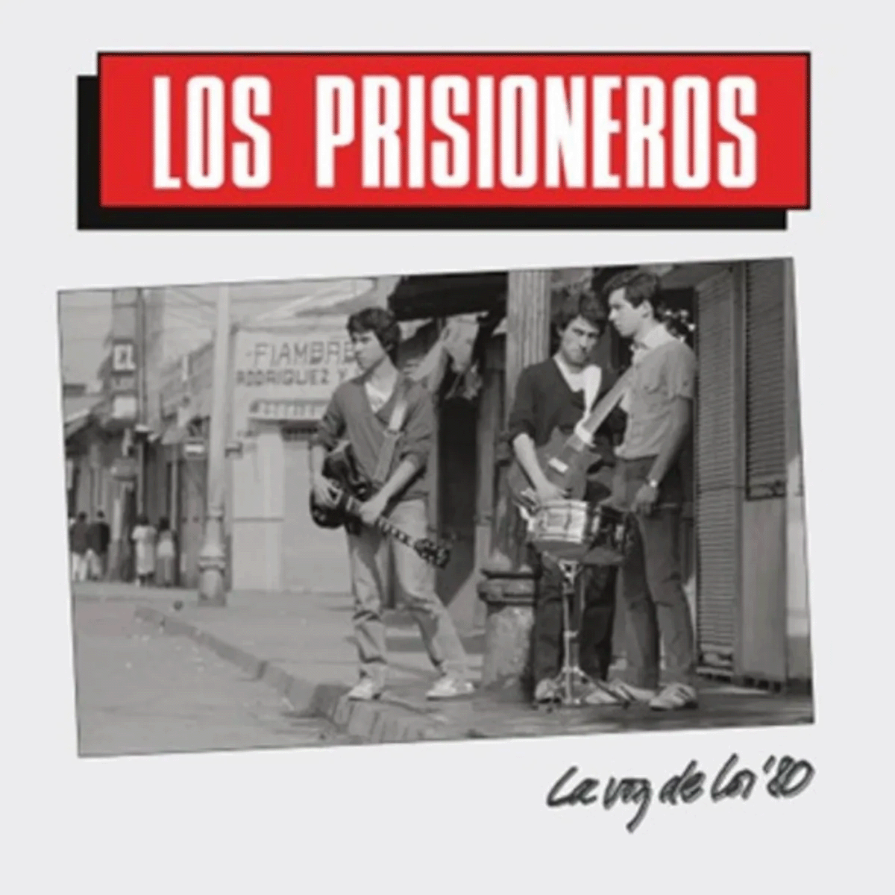

# Solemne-02

## Integrantes del grupo

- (Fernanda Aceituno) [fdaceituno](https://github.com/fdaceituno)

## Descripción del disco



- (La voz de los ´80)
- 1984
- Los Prisioneros
- Tracklist

```txt
1. La voz de los ´80
2. Brigada de negro
3. Latinoamérica es un pueblo al sur de Estados Unidos
4. Eve-evelyn
5. Sexo
6. ¿Quién mató a Marilyn?
7. Paramar
8. No necesitamos banderas
9. Mentelidad televisiva
10. Nunca quedas mal con nadie
```

- Aspecto del álbum a desarrollar (premisa)

> La atmosfera nocturna de la época de juventud de los artistas, ya que me parece
> interesante que en medio de ambiente de fiesta se pudieran escuchar canciones de este tipo,
> con una ideologia que la caracteriza por su crítica directa, sin temor, y eso también se me
> hace interesante, ya que llegaron a ser reconocidos por esto mismo.

## Conclusión del proceso

- Creo que pude expresar lo que quería, que era la relación con la crítica, alzar la voz, manifestarse
- Aunque también pienso que pudo haber estado mucho más potenciado y en ese sentido haber sido mejor utilizando más elementos/ruido
- Sin embargo, también pude explorar un poco más con movimientos simultáneos que se pueden hacer

## Explicación del código (3 aspectos)

### Bloque de código 

```js
//  //frases megafono
  let frases1=["CONTROL", "VOZ", "´80", "LA FUERZA"]
  let frases2=["TV", "CHILE", "JÓVENES", "CUIDAD"]
Aquí let frases, tanto 1 como 2, engloban una selección cada una, por lo que
al utilizar alguno de estos let individualmente, de forma automática saldran las palabras
que están dentro de la selección
```

### Bloque de código 2

```js
//  yPuno=240+sin(frameCount*0.1)*20
   image(puno,475,yPuno,160,200)

con el yPuno se está modificando el eje y de la imagen puno, y con el frameCount se regula
la veloccidad del movimiento, que en este caso, es de y.
y por lo mismo en loss paréntesis de image, en vez que seleccionar un punto de coordenadas
del eje y, solo se pone yPuno, ya que anteriormente ya fue determinado
```

### Bloque de código 3

```js
//   if (frameCount%40<20){
    angulo=radians(-10);
    arriba=true;
  } else{
    angulo=radians(15)
    arriba=false;
  }

Aquí en frameCount también se relaiona con la veloCidad, pero de un movimiento
en dos posiciones determinadas, y angulo=(radians(x), x está indicando la rotación de la misma
imagen pero en dos posiciones distintass
```

### Declaración sobre el uso de IA

- IA utilizada(s) y tipo de licencia (pago, gratuita)

> Chatgpt gratis

- Problema a resolver a través de la IA

> Movimientos de las imagenes, y como ir cambiando la posición del texto

- Prompts utilizados

> Ya puse la imagen en (0,120,220,300), ahora como puedo hacer para que tenga dos cambios de posición,
una un poco inclinada hacia abajo y otra un poco inclinada hacia arriba

> Que la frase hacia arriba esté más en el centro del megáfono, no en la parte de abajo si no que al medio 

> Y como hago para poner un texto sobre esa imagen y que se mueva en conjunto con ella

- Secciones de código entregadas por la IA

```js
//let angulo = 0;

if(frameCount % 40 < 20){
  angulo = radians(-10);
} else {
  angulo = radians(10);
}
push();

translate(110,270);
rotate(angulo);
image(megafono,-110,-150,220,300);
pop();

// translate(70,-90);

//push();
translate(xCartel, 240);
image(cartel, 0, 0, 150, 200);
fill(0);
textSize(20);
textAlign(CENTER);
text("MI MENSAJE", 75, 100);
pop();
```
